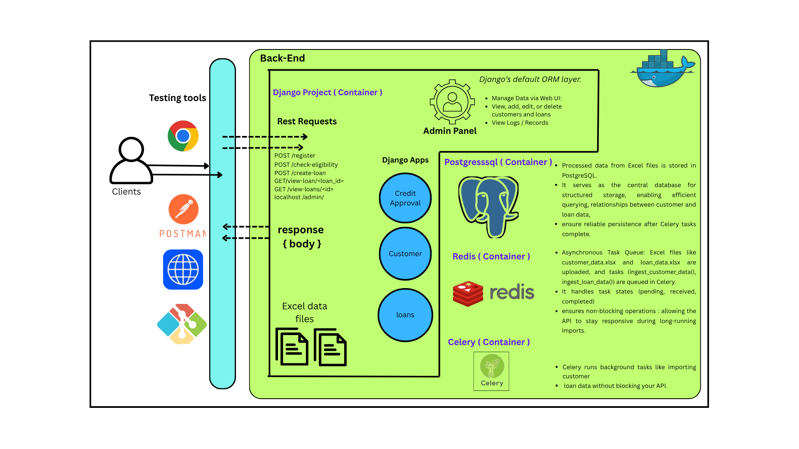

# Credit Approval System 

A Django-based backend application that handles credit eligibility checking, loan processing, and customer data management. It leverages PostgreSQL, Redis, Celery, and Docker for a robust and scalable architecture.

---

## 📁 Project Structure

```
credit_approval/
│
├── backend/
│   ├── core/
│   │   └── management/
│   │       └── commands/
│   │           ├── __init__.py
│   │           └── ingest_data.py
│   │
│   └── credit_approval/
│       ├── __init__.py
│       ├── asgi.py
│       ├── celery.py
│       ├── settings.py
│       ├── urls.py
│       └── wsgi.py
│
├── customers/
│   ├── migrations/
│   │   ├── __init__.py
│   │   └── 0001_initial.py
│   ├── __init__.py
│   ├── admin.py
│   ├── apps.py
│   ├── models.py
│   ├── tasks.py
│   ├── tests.py
│   └── views.py
│
├── loans/
│   ├── migrations/
│   │   └── __init__.py
│   ├── admin.py
│   ├── apps.py
│   ├── models.py
│   ├── tasks.py
│   ├── tests.py
│   ├── urls.py
│   └── views.py
│
├── staticfiles/
│   ├── admin/
│   │   ├── css/
│   │   │   └── vendor/
│   │   │       ├── autocomplete.css
│   │   │       ├── base.css
│   │   │       ├── changelists.css
│   │   │       ├── dark_mode.css
│   │   │       ├── dashboard.css
│   │   │       ├── forms.css
│   │   │       ├── login.css
│   │   │       ├── nav_sidebar.css
│   │   │       ├── responsive.css
│   │   │       ├── responsive_rtl.css
│   │   │       ├── rtl.css
│   │   │       ├── unusable_password_field.css
│   │   │       └── widgets.css
│   │   ├── img/
│   │   │   └── gis/
│   │   │       ├── calendar-icons.svg
│   │   │       ├── icon-addlink.svg
│   │   │       ├── icon-alert.svg
│   │   │       ├── icon-calendar.svg
│   │   │       ├── icon-changelink.svg
│   │   │       ├── icon-clock.svg
│   │   │       ├── icon-deletelink.svg
│   │   │       ├── icon-hidelink.svg
│   │   │       ├── icon-no.svg
│   │   │       ├── icon-unknown-alt.svg
│   │   │       ├── icon-unknown.svg
│   │   │       ├── icon-viewlink.svg
│   │   │       ├── icon-yes.svg
│   │   │       └── inline-delete.svg
│   │   └── js/
│   │       ├── admin/
│   │       ├── autocomplete.js
│   │       ├── calendar.js
│   │       ├── cancel.js
│   │       ├── change_form.js
│   │       ├── core.js
│   │       ├── filters.js
│   │       ├── inlines.js
│   │       ├── jquery.init.js
│   │       ├── nav_sidebar.js
│   │       ├── popup_response.js
│   │       ├── prepopulate_init.js
│   │       ├── prepopulate.js
│   │       ├── SelectBox.js
│   │       ├── SelectFilter2.js
│   │       ├── theme.js
│   │       ├── unusable_password_field.js
│   │       └── urlify.js
│   │
│   ├── customer_data.xlsx
│   ├── loan_data.xlsx
│   ├── manage.py
│   ├── docker-compose.yml
│   ├── Dockerfile
│   └── requirements.txt

```

---

## ⚙️ Architecture



---


## ⚙️ Technologies Used

- **Django 5.1.1**: Web framework for backend logic and ORM.
- **PostgreSQL**: Relational database to store customer and loan data.
- **Celery + Redis**: Asynchronous task queue for ingestion tasks.
- **Docker + Docker Compose**: Containerization and orchestration.
- **DRF** (`@api_view`): For defining REST API endpoints.

---

## 🔧 Setup Instructions

### 🔹 1. Clone the Repository

```bash
git clone <repo-url>
cd credit_approval/backend
```

### 🔹 2. Build & Run with Docker

```bash
docker-compose up --build
```

This will start 3 containers:
- `web`: Django backend server
- `db`: PostgreSQL
- `redis`: Redis for Celery
- `celery`: Celery
### 🔹 3. Apply Migrations

```bash
docker-compose run --rm web python manage.py migrate
```

### 🔹 4. Load Static Files (Admin UI)

```bash
docker-compose run --rm web python manage.py collectstatic
```

### 🔹 5. Create Superuser (Optional)

```bash
docker-compose run --rm web python manage.py createsuperuser
```

Access Django Admin at: [http://localhost:8000/admin](http://localhost:8000/admin)

---

## 📬 API Endpoints

### ✅ Customer APIs
- `POST /register`: Add a new customer and auto-calculate approved limit.
- `POST /check-eligibility`: Check loan eligibility and return result.

### ✅ Loan APIs
- `POST /create-loan`: Create a loan after checking rules.
- `GET /view-loan/<loan_id>`: View loan details + customer data.
- `GET /view-loans/<customer_id>`: View all loans of a customer.

---

## Business Logic

- Credit score calculated using:
  - Past loans paid on time
  - Number of past loans
  - Loans this year
  - Total loan volume
  - Debt > approved limit = score 0

- Loan eligibility:
  - Score > 50 → Approved
  - 30 < Score ≤ 50 → ≥12% interest required
  - 10 < Score ≤ 30 → ≥16% interest required
  - Score ≤ 10 → Rejected

- EMI must be ≤ 50% of monthly salary.

- If interest rate provided doesn't match slab, `corrected_interest_rate` is returned.

---

##  Testing

Run unit tests:

```bash
docker-compose run --rm web python manage.py test
```

Test Coverage:
- `/register`
- `/check-eligibility`
- `/create-loan`
- `/view-loan/<loan_id>`
- `/view-loans/<customer_id>`

---

## 📦 Docker Services

### Dockerfile (web)
```dockerfile
FROM python:3.10-slim
WORKDIR /code
COPY requirements.txt .
RUN pip install -r requirements.txt
COPY . .
```

### docker-compose.yml
```yaml
services:
  web:
    build: .
    ports:
      - "8000:8000"
    depends_on:
      - db
      - redis
  db:
    image: postgres
    environment:
      POSTGRES_DB: creditdb
      POSTGRES_USER: postgres
      POSTGRES_PASSWORD: postgres
  redis:
    image: redis
```

---

## 🏁 Final Notes

- Ensure Docker is installed and running.
- Admin panel styled with static files served using WhiteNoise.
- `loan_data.xlsx` and `customer_data.xlsx` used for ingestion.

---
 by Swaraj Pawar